# 🧑🏽‍🚒 `palisades`: Post-Disaster Land Cover Classification

[SemSeg](https://github.com/kamangir/roofai) on [Maxar Open Data](https://github.com/kamangir/blue-geo/tree/main/blue_geo/catalog/maxar_open_data) acquisitions. 

```mermaid
graph LR
    palisades_ingest_query_ingest["palisades ingest~~- <query-object-name> scope=<scope>"]

    palisades_ingest_target["palisades ingest~~- target=<target> ~ingest_datacubes"]

    palisades_ingest_target_ingest["palisades ingest~~- target=<target> scope=<scope>"]

    palisades_label["palisades label offset=<offset>~~- <query-object-name>"]

    palisades_train["palisades train~~- <query-object-name> count=<count> <dataset-object-name> epochs=<5> <model-object-name>"]

    palisades_predict["palisades predict~~ingest~~- <model-object-name> <datacube-id> <prediction-object-name>"]

    target["🎯 target"]:::folder
    query_object["📂 query object"]:::folder
    datacube_1["🧊 datacube 1"]:::folder
    datacube_2["🧊 datacube 2"]:::folder
    datacube_3["🧊 datacube 3"]:::folder
    dataset_object["🏛️ dataset object"]:::folder
    model_object["🏛️ model object"]:::folder
    prediction_object["📂 prediction object"]:::folder

    query_object --> datacube_1
    query_object --> datacube_2
    query_object --> datacube_3

    query_object --> palisades_ingest_query_ingest
    palisades_ingest_query_ingest --> datacube_1
    palisades_ingest_query_ingest --> datacube_2
    palisades_ingest_query_ingest --> datacube_3

    target --> palisades_ingest_target
    palisades_ingest_target --> query_object

    target --> palisades_ingest_target_ingest
    palisades_ingest_target_ingest --> query_object
    palisades_ingest_target_ingest --> datacube_1
    palisades_ingest_target_ingest --> datacube_2
    palisades_ingest_target_ingest --> datacube_3

    query_object --> palisades_label
    palisades_label --> datacube_1

    query_object --> palisades_train
    palisades_train --> dataset_object
    palisades_train --> model_object

    model_object --> palisades_predict
    datacube_1 --> palisades_predict
    palisades_predict --> prediction_object

    classDef folder fill:#999,stroke:#333,stroke-width:2px;
```



<details>
<summary>palisades help</summary>

--help-- palisades ingest help
--help-- palisades label help
--help-- palisades train help
--help-- palisades predict help

</details>


## round one - step by step

1️⃣ running a query,

```bash
palisades ingest ~upload \
  target=Palisades-Maxar  \
  ~ingest_datacubes
```

```bash
$PALISADES_QUERY_OBJECT_PALISADES_MAXAR
```

[palisades-Palisades-Maxar-query-2025-01-16-181ejb](https://kamangir-public.s3.ca-central-1.amazonaws.com/palisades-Palisades-Maxar-query-2025-01-16-181ejb.tar.gz)

<details>
<summary>details</summary>

```yaml
datacube_id:
- datacube-maxar_open_data-WildFires-LosAngeles-Jan-2025-11-031311102212-103001010B9A1B00
- datacube-maxar_open_data-WildFires-LosAngeles-Jan-2025-11-031311102213-103001010B9A1B00
- datacube-maxar_open_data-WildFires-LosAngeles-Jan-2025-11-031311102212-103001010C7D2D00
- datacube-maxar_open_data-WildFires-LosAngeles-Jan-2025-11-031311102213-103001010C7D2D00
- datacube-maxar_open_data-WildFires-LosAngeles-Jan-2025-11-031311102212-10400100A06B8000
- datacube-maxar_open_data-WildFires-LosAngeles-Jan-2025-11-031311102213-10400100A06B8000
- datacube-maxar_open_data-WildFires-LosAngeles-Jan-2025-11-031311102212-10400100A0B73800
- datacube-maxar_open_data-WildFires-LosAngeles-Jan-2025-11-031311102213-10400100A0B73800
- datacube-maxar_open_data-WildFires-LosAngeles-Jan-2025-11-031311102212-10400100A1AFE700
- datacube-maxar_open_data-WildFires-LosAngeles-Jan-2025-11-031311102213-10400100A1AFE700
```

Also ingested `Palisades-Maxar-test` into `$PALISADES_QUERY_OBJECT_PALISADES_MAXAR_TEST`.

```yaml
datacube_id:
- datacube-maxar_open_data-WildFires-LosAngeles-Jan-2025-11-031311102212-103001010B9A1B00
- datacube-maxar_open_data-WildFires-LosAngeles-Jan-2025-11-031311102213-103001010B9A1B00
```

</details>

2️⃣ ingesting the datacubes,

```bash
palisades ingest upload \
  $PALISADES_QUERY_OBJECT_PALISADES_MAXAR_TEST \
  scope=rgb,upload
```

3️⃣ labelling one datacube,

```bash
@select $BLUE_GEO_PALISADES_TEST_DATACUBE
@datacube ingest scope=rgb .
@datacube label - .
```

```python
datacube.label
```


4️⃣ creating a single-datacube dataset,

[palisades-dataset-v1](https://kamangir-public.s3.ca-central-1.amazonaws.com/palisades-dataset-v1.tar.gz)

```yaml
datacube_id:
- datacube-maxar_open_data-WildFires-LosAngeles-Jan-2025-11-031311102213-103001010B9A1B00
```

[datacube-maxar_open_data-WildFires-LosAngeles-Jan-2025-11-031311102213-103001010B9A1B00](https://kamangir-public.s3.ca-central-1.amazonaws.com/datacube-maxar_open_data-WildFires-LosAngeles-Jan-2025-11-031311102213-103001010B9A1B00.tar.gz)

```bash
palisades label \
  offset=0 \
  upload \
  palisades-dataset-v1
```


```yaml
rasterize:
  counts:
    affected: 1178601
    background: 0
    unaffected: 1412780
  label_count: 51
  label_filename: label.shp
  list_of_classes:
  - background
  - affected
  - unaffected
  reference_filename: 11-031311102213-103001010B9A1B00-103001010B9A1B00-visual.tif
```

5️⃣ reviewing the dataset,

```bash
roofai dataset review download \
  palisades-dataset-v1 \
  --index 0 \
  --subset train
```


```yaml
datacube_id:
- datacube-maxar_open_data-WildFires-LosAngeles-Jan-2025-11-031311102213-103001010B9A1B00
kind: distributed
source: catalog_query
```

6️⃣ ingesting from the dataset,

```bash
roofai dataset ingest \
  source=palisades-dataset-v1 - \
  --test_count 1000 \
  --train_count 8000 \
  --val_count 1000
```

[palisades-dataset-v1-ingest-2025-01-19-v48x7l](https://kamangir-public.s3.ca-central-1.amazonaws.com/palisades-dataset-v1-ingest-2025-01-19-v48x7l.tar.gz)

| | |
|-|-|
|  |  |


```yaml
classes:
- background
- affected
- unaffected
kind: CamVid
num:
  test: 125
  train: 1001
  val: 125
source: palisades-dataset-v1
```

7️⃣ train,

dataset: `125 X test + 1,002 X train + 125 X val`.

[palisades-dataset-v1-ingest-2025-01-20-520ze1-model-2025-01-20-s5xtkp](https://kamangir-public.s3.ca-central-1.amazonaws.com/palisades-dataset-v1-ingest-2025-01-20-520ze1-model-2025-01-20-s5xtkp.tar.gz)


```json
{
  "activation": "sigmoid",
  "classes": [
    "affected"
  ],
  "elapsed_time": 289.52636790275574,
  "encoder_name": "se_resnext50_32x4d",
  "encoder_weights": "imagenet",
  "epics": {
...
    "4": {
      "train": {
        "dice_loss": 0.27682340807384914,
        "iou_score": 0.5929118207996587
      },
      "valid": {
        "dice_loss": 0.18688242530822755,
        "iou_score": 0.7735828969767486
      }
    }
  }
}
```

```bash
palisades train - \
  palisades-dataset-v1 \
  count=100000 - \
  profile=FULL,upload,epochs=5 -
```

8️⃣ geoimage predict,


```bash
palisades predict ingest \
    profile=FULL,upload \
    palisades-dataset-v1-ingest-2025-01-20-520ze1-model-2025-01-20-s5xtkp \
    datacube-maxar_open_data-WildFires-LosAngeles-Jan-2025-11-031311102213-103001010B9A1B00
```

[predict-datacube-maxar_open_data-WildFires-LosAngeles-Jan-2025-11-031311102213-103001010B9A1B00-2025-01-20-x54yb0](https://kamangir-public.s3.ca-central-1.amazonaws.com/predict-datacube-maxar_open_data-WildFires-LosAngeles-Jan-2025-11-031311102213-103001010B9A1B00-2025-01-20-x54yb0.tar.gz)

| | |
|-|-|
|  |  |

```yaml
predict:
  elapsed_time: 150.75683450698853
```


✅