# 🧑🏽‍🚒 `palisades`

🧑🏽‍🚒 Post-disaster land Cover classification using [Semantic Segmentation](https://github.com/kamangir/roofai) on [Maxar Open Data](https://github.com/kamangir/blue-geo/tree/main/blue_geo/catalog/maxar_open_data) acquisitions. 

```bash
pip install palisades
```

```mermaid
graph LR
    palisades_ingest_query_ingest["palisades ingest~~- <query-object-name> scope=<scope>"]

    palisades_ingest_target["palisades ingest~~- target=<target> ~ingest_datacubes"]

    palisades_ingest_target_ingest["palisades ingest~~- target=<target> scope=<scope>"]

    palisades_label["palisades label offset=<offset>~~- <query-object-name>"]

    palisades_train["palisades train~~- <query-object-name> count=<count> <dataset-object-name> epochs=<5> <model-object-name>"]

    palisades_predict["palisades predict~~ingest~~- <model-object-name> <datacube-id> <prediction-object-name>"]

    target["🎯 target"]:::folder
    query_object["📂 query object"]:::folder
    datacube_1["🧊 datacube 1"]:::folder
    datacube_2["🧊 datacube 2"]:::folder
    datacube_3["🧊 datacube 3"]:::folder
    dataset_object["🏛️ dataset object"]:::folder
    model_object["🏛️ model object"]:::folder
    prediction_object["📂 prediction object"]:::folder

    query_object --> datacube_1
    query_object --> datacube_2
    query_object --> datacube_3

    query_object --> palisades_ingest_query_ingest
    palisades_ingest_query_ingest --> datacube_1
    palisades_ingest_query_ingest --> datacube_2
    palisades_ingest_query_ingest --> datacube_3

    target --> palisades_ingest_target
    palisades_ingest_target --> query_object

    target --> palisades_ingest_target_ingest
    palisades_ingest_target_ingest --> query_object
    palisades_ingest_target_ingest --> datacube_1
    palisades_ingest_target_ingest --> datacube_2
    palisades_ingest_target_ingest --> datacube_3

    query_object --> palisades_label
    palisades_label --> datacube_1

    query_object --> palisades_train
    palisades_train --> dataset_object
    palisades_train --> model_object

    model_object --> palisades_predict
    datacube_1 --> palisades_predict
    palisades_predict --> prediction_object

    classDef folder fill:#999,stroke:#333,stroke-width:2px;
```



<details>
<summary>palisades help</summary>

--help-- palisades ingest help
--help-- palisades label help
--help-- palisades train help
--help-- palisades predict help

</details>

--table--

---

--signature--